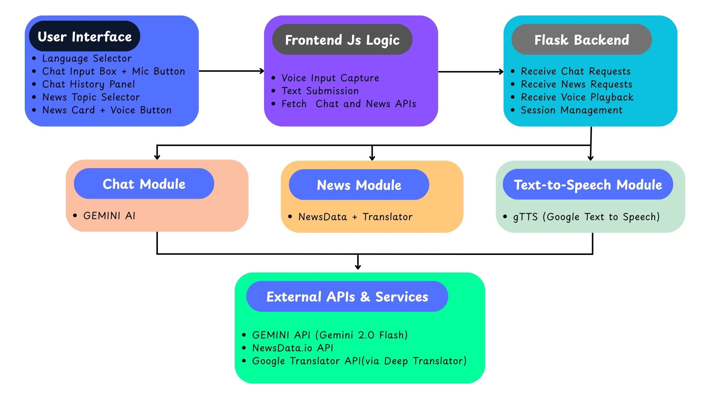
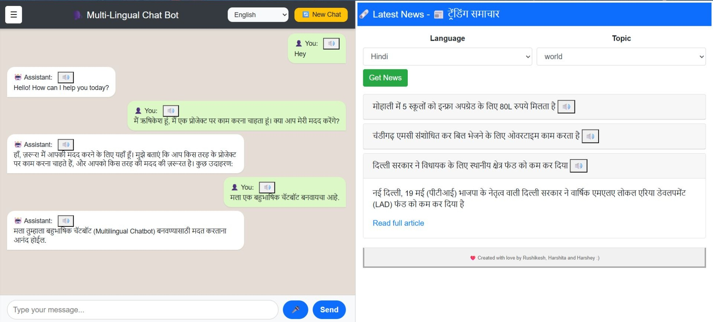

# 🌐 Multilingual Chat and News Bot

A full-stack web application that integrates a Gemini Pro-powered multilingual chatbot with a multilingual news reader. Users can chat in their chosen language and stay updated with trending news translated into Indian regional languages. The app supports text-to-speech and persistent chat history for an interactive experience.

---

## 🚀 Features

### 🤖 Multilingual Chatbot (Left Panel)
- Powered by **Google Gemini Pro** for natural language conversations.
- Supports **voice input** in the user's selected language.
- Translates non-Hindi inputs automatically.
- Saves **chat history** with session titles in a **SQLite database**.
- Allows switching between previous conversations.

### 📰 Multilingual News Reader (Right Panel)
- Fetches **live trending news** using the **NewsData API**.
- Supports news translation to **Hindi, Marathi, Tamil, Telugu, Urdu, Malayalam, Sanskrit**, and **English**.
- Clickable headlines to expand and read full news.
- Integrated **text-to-speech** using `gTTS` in the selected language.

---

## System Implementation

| System-Implementation | 
|-----------------------------|
|  |


## 🔄 Working Flow


```text
                     +-----------------------------+
                     |        User Interface       |
                     | - Language Selector         |
                     | - Chat Input Box + Mic Btn  |
                     | - Chat History Panel        |
                     | - News Topic Selector       |
                     | - News Cards + Voice Btn    |
                     +-------------+---------------+
                                   |
                                   v
                     +-----------------------------+
                     | Frontend JavaScript Logic   |
                     | - Voice Input Capture       |
                     | - Text Input Submission     |
                     | - Fetch Chat & News APIs    |
                     | - Play Audio Files          |
                     +-------------+---------------+
                                   |
                                   v
                     +-----------------------------+
                     |        Flask Backend        |
                     | - Receive Chat Requests     |
                     | - Receive News Requests     |
                     | - Receive Voice Playback    |
                     | - Session Management        | 
                     +-------------+---------------+
                     |             |               |
                     |             |               |
                     v             v               v
            +------------+  +--------------+  +-------------------+
            | Chat Module|  | News Module  |  | Text-to-Speech    |
            | (Gemini AI)|  | (NewsData    |  | Module (gTTS)     |
            |            |  | + Translator)|  |                   |
            +------------+  +--------------+  +-------------------+
                     |             |               |
                     +-------------+---------------+
                                   |
                                   v 
              +------------------------------------------------+
              |              External APIs & Services          |
              | - Google Gemini Pro AI                         |
              | - NewsData.io API                              |
              | - Google Translator API (via Deep Translator)  |
              | - Google Text-to-Speech (gTTS)                 |
              +------------------------------------------------+
                                   |
                                   v
                     +-----------------------------+
                     |     SQLite Database         |
                     | - Store Chat History        |
                     | - Session & Message Data    |
                     +-----------------------------+
```

---

## 🗂️ Project Structure

```text
Multilingual Chat and News Bot/
├── app.py                      # Flask backend controller
├── chat_module.py              # Gemini Pro logic
├── news_module.py              # News fetching + translation
├── read_news_module.py         # gTTS-based audio generation
├── setup_db.py                 # DB setup script
├── .env                        # Secure API keys
├── templates/
│   └── index.html              # Jinja-based frontend
├── static/
│   ├── style.css               # Custom styles
│   ├── script.css              # (typo?) Likely meant to be script.js
├── requirements.txt            # Python dependencies
├── db/
│   └── chat_history.db         # SQLite database
└── __pycache__/                # Python bytecode cache
```

---

## 🛠️ Installation

### 1. Clone the Repository

```bash
git clone https://github.com/yourusername/multilingual-chat-news-bot.git
cd multilingual-chat-news-bot
```

### 2. Create a Virtual Environment (Optional)
```bash
python -m venv venv
source venv/bin/activate  # On Windows use: venv\Scripts\activate
```

### 3. Install Dependencies
```bash
pip install -r requirements.txt
```

### 4. Add Your .env File
Create a .env file in the root directory and include:
```bash
GOOGLE_API_KEY = "your_gemini_api_key"
NEWSDATA_API_KEY = "your_newsdata_api_key'
```

---

## 🧪 Run the Application
```bash
python app.py
```
Open http://localhost:5000 in your browser.

---

## 🌍 Supported Languages

|  Hindi   | Marathi |  Urdu   | Malayalam | Sanskrit | Tamil  | Telugu    |
| -------- | ------- | -------- | ------- | -------- | ------- | -------- |

---

## 🔊 Voice Support
- Use the mic icon to speak your query in the chatbot.
- Use the speaker icon to listen to news in the selected language..

---

## 🧠 Tech Stack
- Flask – Web framework
- Google Generative AI – Chatbot via Gemini Pro
- NewsData API – Real-time news
- gTTS – Google Text-to-Speech
- deep-translator – Language translation
- SQLite – Database for chat history

---

## 📷 Screenshots

| User Interface | 
|-----------------------------|
|  |

---

## 👥 Team

| Name               | GitHub Profile                               |
|--------------------|-----------------------------------------------|
| Rushikesh Sonwane    | [@RushikeshSonwane03](https://github.com/RushikeshSonwane03/) |
| Harshita Singh      | [@HS-4791](https://github.com/HS-4791)        |
| Harshey Sharma     | [@Harshey260](https://github.com/Harshey260)        |

> ✨ Feel free to explore our profiles and contributions!

---

## 🤝 Contributing
Pull requests are welcome. For major changes, please open an issue first to discuss what you'd like to change.

---
